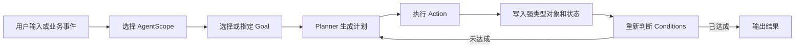
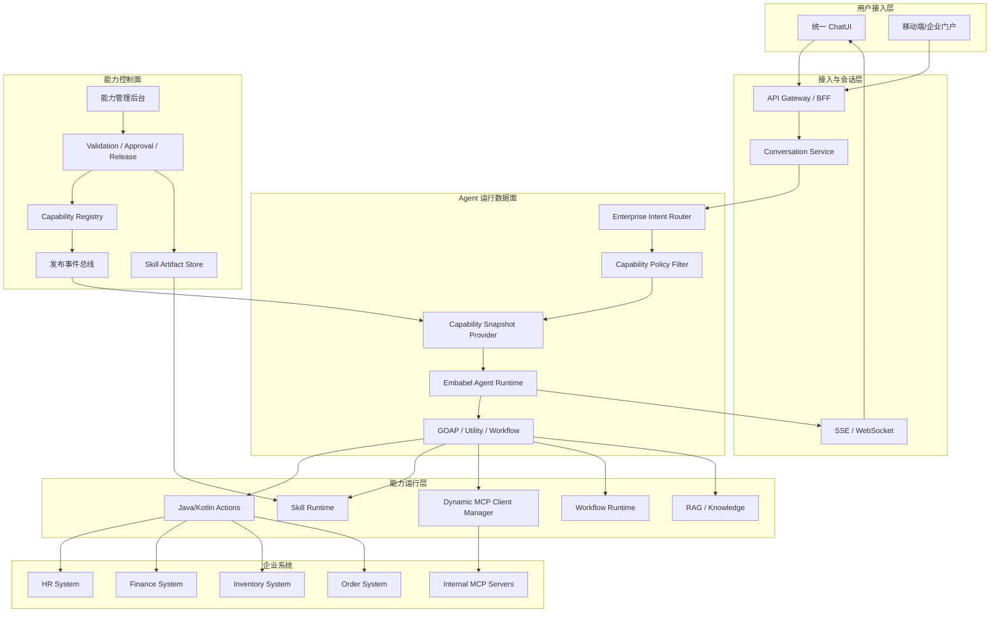
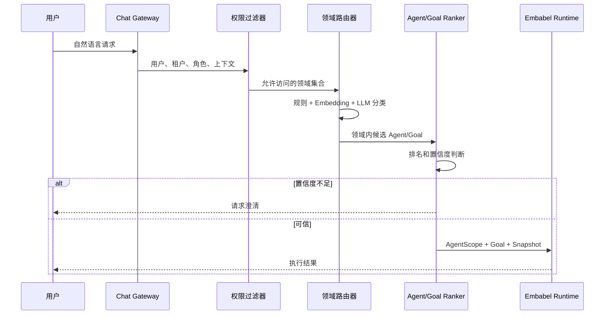
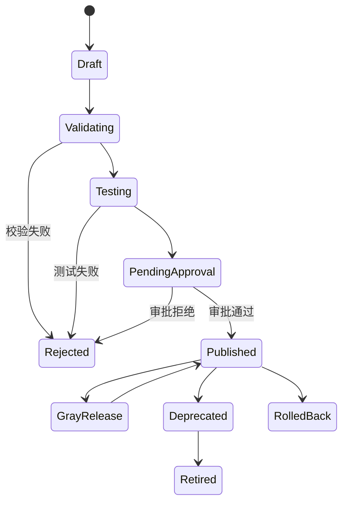
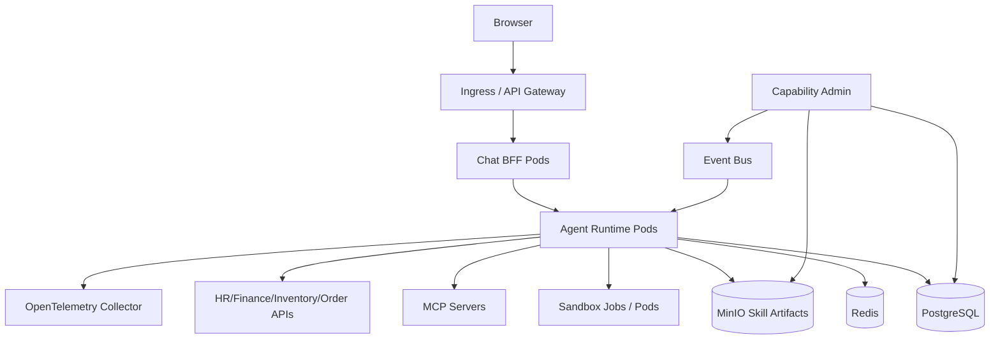

# 企业智能业务助手推荐架构设计

> 基于 Embabel Agent Framework 的企业私有化、多领域、可扩展智能业务助手架构方案

| 项目 | 内容 |
|---|---|
| 文档状态 | 推荐架构 |
| 适用版本 | Embabel Agent Framework 1.5.0（release）/ 1.5.1 开发版 |
| 目标读者 | 企业架构师、技术负责人、后端开发、AI 平台团队、安全与运维团队 |
| 适用部署 | 企业内网、私有云、专有云、Kubernetes |

## 1. 文档概述

### 1.1 建设背景

企业通常同时运行人力、财务、库存、订单、采购、合同、知识库等多个业务系统。传统入口按系统划分，用户需要理解系统边界、菜单和流程；引入大模型后，可以为员工提供统一 ChatUI，由系统理解自然语言需求，选择正确的业务领域、执行路径和外部系统能力。

本方案以 Embabel 为 Agent 执行和规划内核，在其上建设企业能力注册、意图路由、Skill 发布、MCP 动态接入、安全治理和可观测平台，使用户通过统一问答入口无感获得跨领域业务能力。

### 1.2 建设目标

1. 为企业员工提供统一 ChatUI，不要求用户理解后端系统和技术协议。
2. 支持人力、财务、库存、订单等领域 Agent 的独立建设和统一接入。
3. 根据用户意图、权限和上下文动态选择 Agent、Goal、Action、Workflow、Skill 和 MCP Tool。
4. 支持 Skill 在内网注册、测试、审批、发布、灰度、回滚和下线。
5. 支持 MCP Server 持续接入、健康检查、工具发现、认证和动态下线。
6. 保证多租户隔离、最小权限、敏感数据保护、操作确认和全链路审计。
7. 支持私有化高可用部署、水平扩容、故障降级和可观测运营。

### 1.3 非目标

本方案不建议用大模型或 Skill 替代所有传统业务代码。核心交易、账务、库存扣减、审批状态变更等强一致性逻辑仍应由 Java/Kotlin 服务、数据库事务和成熟工作流系统承担。Agent 负责理解、协调、规划和调用，不应成为业务事实的唯一保存者。

### 1.4 核心术语

| 术语 | 含义 |
|---|---|
| Agent | 一组 Goals、Actions、Conditions 和领域类型组成的业务能力单元 |
| Goal | 用户或系统希望达成的业务结果 |
| Action | 可执行步骤，可调用代码、LLM、Skill、MCP 或子流程 |
| Condition | Action 前置条件、执行效果或 Goal 达成条件 |
| GOAP | 根据当前世界状态动态规划 Action 路径的算法 |
| Workflow | 开发者明确规定结构的流程，如审批、循环、分支和并行聚合 |
| Skill | 遵循 Agent Skills 规范的说明、引用资料、资源和可选脚本包 |
| MCP | Model Context Protocol，用于标准化接入外部工具、资源和提示 |
| Capability | 本文对 Action、Workflow、Skill、MCP Tool 等能力的统一抽象 |
| Capability Snapshot | 某一时刻、某租户和用户范围内可使用能力的不可变版本集合 |

### 1.5 架构原则

1. 先权限过滤，再交给 LLM 选择，禁止把越权能力暴露给模型。
2. 领域优先、分层路由，避免一个超级 Agent 直接面对全企业能力。
3. 查询型任务可以自动执行，高风险写操作必须确认或审批。
4. Skill 和 MCP 使用不可变版本与快照，保证会话执行一致性。
5. 大模型负责语义判断，业务代码负责规则、事务和最终授权。
6. 运行节点只消费已发布制品，不在用户请求过程中直接拉取外部 Git 仓库。
7. 所有外部调用必须可超时、可熔断、可审计、可降级。

## 2. Embabel 项目能力分析

### 2.0 官方指导现状与参考应用

截至 1.5.x，Embabel 官方未给出企业级应用架构蓝图：

- 文档站 `reference/architecture` 一节为空壳，仅指向 Planner、AgentPlatform、AgentProcess 等框架内部机制说明；`roadmap` 一节亦无实质内容。
- README Roadmap 中 "Integrate with data stores and demonstrate the power of surfacing existing functionality inside an organization" 仍为未完成目标，企业数据集成侧仍在演进。
- 官方定位是框架/库（"Built on Spring and the JVM"）：持久化、安全、Web 层明确交给 Spring 生态，Embabel 只负责 Agent 编排。

官方给出的是参考应用形态，可作为落地对齐基准：

| 参考应用 | 形态 | 对本方案的启示 |
|---|---|---|
| Tripper | Spring MVC Controller + htmx + `AgentInvocation.invokeAsync()` + 状态轮询/SSE | 前后端协作与 Focused 调用的官方范式 |
| rag-demo | `Chatbot` bean + Jinja 模板 + RAG | 统一 ChatUI 后端的官方范式 |
| java/kotlin-agent-template | Spring Boot + Spring Shell | 开发期入口模板，非生产形态 |

因此本文档设计的路由、能力快照、Skill/MCP 平台、权限与审计等平台能力均需自建，不存在可直接照抄的官方蓝图。单应用落地样例参见同仓库《合同智审应用入门指南.md》。

### 2.1 项目定位

Embabel 是运行于 JVM 和 Spring 生态中的强类型 Agent 框架。它将 LLM 交互、普通业务代码、领域对象、工具和动态规划组合在同一个 Agent Process 中。

核心实现主要位于：

- `embabel-agent-api`：Agent、Goal、Action、Planner、PromptRunner 和工具抽象。
- `embabel-agent-autoconfigure`：Spring Boot 自动配置和模型接入。
- `embabel-agent-skills`：Agent Skills 规范、加载和脚本执行。
- `embabel-agent-mcp`：MCP Server 导出与安全扩展。
- `embabel-agent-rag`：检索增强能力。
- `embabel-agent-a2a`：Agent-to-Agent 协议。
- `embabel-agent-observability`：Tracing 和指标。
- `embabel-agent-shell`：开发和调试入口。

### 2.2 核心执行模型



### 2.3 执行模式

| 模式 | 说明 | 企业使用建议 |
|---|---|---|
| Focused | 代码直接指定 Agent 或功能 | API、事件驱动、确定性业务入口 |
| Closed | 根据意图选择 Agent，只使用该 Agent 的能力 | 人力、财务、订单等单领域路由 |
| Open | 选择 Goal，并从范围内的 Actions 动态组合 Agent | 跨领域、探索型、复杂分析任务 |

Open 模式能力最强，但确定性最低。企业落地时应对 AgentScope 做约束，不建议默认开放平台全部 Actions。

### 2.4 Planner 与 Workflow

Embabel 支持 GOAP、Utility、Hybrid 和 Supervisor 等 Planner。Workflow Builder 可构建固定结构的 Agent，也可以在 Action 中作为子流程运行。

建议关系如下：

```text
意图路由 -> Agent/Goal -> 选择 Planner -> 执行 Actions
                               -> 某个 Action 内可运行固定 Workflow 子流程
```

不应把 GOAP 当作业务入口。GOAP 是 Agent Process 内部的执行策略，真正的业务入口应是 Agent 或 Goal。

### 2.5 Skill 能力现状

项目已经提供：

- 本地目录、GitHub 和一般 Git URL 加载。
- `SKILL.md` frontmatter 和正文解析。
- `scripts/`、`references/`、`assets/` 资源访问。
- Skill 延迟激活和 PromptRunner 工具暴露。
- Python、Bash、JavaScript、Kotlin Script 执行。
- 本机 Process 和 Docker 沙箱执行引擎。

当前缺少企业级注册中心、版本库、审批、灰度、回滚、租户权限和热发布管理。

### 2.6 MCP 能力现状

项目可以：

- 作为 MCP Client 消费 STDIO、SSE、Streamable HTTP 服务。
- 创建同步或异步 MCP Client。
- 将 MCP 工具转换为 Embabel ToolGroup。
- 将 Embabel Goal、ToolObject 和 LlmReference 导出为 MCP Server 能力。
- 使用 Spring Security SpEL 对远程工具调用授权。

当前 MCP Client 和 ToolGroup 主要由 Spring 启动期配置创建，动态增加连接、刷新工具列表和下线连接需要企业扩展。

### 2.7 模型接入与 BYOK 现状

官方 starter 已覆盖主流模型，其中 Z.ai（GLM 系列）与 DeepSeek 为 Stable 状态，MiniMax、DashScope（Qwen）等亦有官方接入文档；`embabel-agent-starter-byok`（1.5 新增，Incubating）支持密钥运行时供给、无密钥也能启动，适配企业密钥治理。

1.5 起 LLM 角色经 SPI 解析，role 与供应商解耦。`embabel.models.llms` 角色映射（如 extractor/reviewer/writer）是企业模型治理的官方挂点：代码只引用角色名，换模型改配置即可。

| Starter | 状态 | 用途 |
|---|---|---|
| embabel-agent-starter-zai | Stable | Z.ai GLM 系列 |
| embabel-agent-starter-deepseek | Stable | DeepSeek |
| embabel-agent-starter-byok | Incubating | 密钥运行时供给，无密钥启动 |
| embabel-agent-starter-ollama / -dockermodels / -lmstudio | Stable/Incubating | 本地与内网私有化模型 |
| embabel-agent-starter-anthropic / -openai / -bedrock / -gemini 等 | Stable | 海外云与官方 API |

### 2.8 企业落地的能力边界

| 能力 | Embabel 原生提供 | 企业需要建设 |
|---|---|---|
| Agent 执行与规划 | 是 | 领域建模和策略配置 |
| Agent/Goal LLM 排名 | 是 | 分层路由、评测和规则增强 |
| Skill 解析与执行 | 是 | 制品库、审批、版本和权限 |
| MCP 客户端基础 | 是 | 动态连接管理、健康检查和凭证治理 |
| Chat 会话与存储 | 部分：Chatbot/Conversation 抽象原生，Neo4j 持久化由外部 embabel-chat-store 模块提供，contextId 支持跨会话恢复 Blackboard | 企业运营级会话服务、多存储适配与备份 |
| 安全扩展点 | 部分 | 统一 IAM、ABAC、审计和确认流程 |
| 可观测基础 | 是 | 企业指标、SLA、成本和运营看板 |

## 3. 企业业务场景与需求分析

### 3.1 人力领域

典型请求包括：

- 查询个人年假和考勤异常。
- 查询员工档案和组织关系。
- 发起入职、转岗、离职流程。
- 生成岗位说明和招聘需求。
- 汇总部门人员结构和用工风险。

查询请求可以自动执行；涉及员工敏感信息、薪酬和人事变更时必须进行字段级授权和操作确认。

### 3.2 财务领域

典型请求包括预算查询、报销单创建、付款状态查询、财务报告生成和费用异常分析。账务写入、付款和预算冻结属于高风险操作，应通过固定 Workflow、业务服务事务和审批系统完成，不建议交由开放式 GOAP 自由组合。

### 3.3 库存领域

典型请求包括库存查询、缺货预警、可用量计算、补货建议、库存调拨和盘点差异分析。查询和分析适合 GOAP；实际扣减、调拨和盘点确认必须调用库存系统正式接口。

### 3.4 订单领域

典型请求包括订单查询、物流跟踪、订单创建、修改、取消、退款和积压分析。订单状态变化应使用幂等业务接口，并保存请求号、操作人、确认记录和业务系统响应。

### 3.5 跨领域请求

例如：

> 根据未发货订单和当前库存生成补货计划，并估算采购预算。

该请求同时涉及订单、库存、采购和财务。系统应先识别领域集合，再生成受限 AgentScope，只允许这几个领域中与当前用户权限匹配的能力参与规划。

### 3.6 用户无感的含义

用户不需要知道底层使用了 Skill、MCP 或 Action，但系统仍应在必要时展示：

- 需要补充的信息。
- 将要执行的高风险业务动作。
- 需要用户确认或审批的内容。
- 最终结果来源和可审计业务编号。

“技术无感”是目标，“风险无提示”不是目标。

## 4. 推荐总体架构

### 4.1 总体逻辑架构



### 4.2 控制面与数据面

控制面负责低频但高治理要求的操作：注册、校验、审批、发布、下线、权限配置和版本管理。数据面负责高频用户请求：路由、快照读取、Agent 执行、Skill/MCP 调用和结果返回。

控制面故障时，数据面应继续使用最后一个有效快照运行，避免注册中心短暂不可用影响员工问答。

### 4.3 核心组件职责

| 组件 | 职责 |
|---|---|
| Chat BFF | 鉴权、会话、文件上传、流式输出、确认交互 |
| EnterpriseIntentRouter | 领域分类、Agent/Goal 排名、多意图拆分 |
| CapabilityPolicyFilter | 根据租户、用户、部门、数据级别过滤能力 |
| CapabilitySnapshotProvider | 提供稳定、不可变、可审计的能力集合 |
| Embabel Agent Runtime | 创建 AgentProcess，执行 Planner 和 Actions |
| Skill Runtime | 加载已发布 Skill，提供资源和脚本工具 |
| DynamicMcpClientManager | 动态管理 MCP 连接、认证、工具列表和健康状态 |
| Capability Registry | 保存统一能力元数据、版本、状态、权限和依赖 |
| Audit Service | 记录路由、工具调用、确认、结果和错误 |

## 5. 统一 ChatUI 架构

### 5.1 ChatUI 功能边界

统一 ChatUI 至少需要支持：

- 多轮文本问答。
- 文件和图片上传。
- SSE 或 WebSocket 流式输出。
- 表格、引用、下载文件和业务卡片展示。
- 澄清问题和表单补全。
- 高风险动作确认。
- Agent Process 进度和可取消操作。
- 会话历史、收藏和反馈。

### 5.2 会话与身份

每个请求应携带：

```text
tenantId
userId
departmentId
roles/authorities
conversationId
correlationId
locale
dataClassification
```

身份信息进入 `ProcessOptions.identities`，工具需要的 Token、tenantId 和 correlationId 通过 `ToolCallContext` 传递，避免成为 LLM 可见 JSON 参数。

### 5.3 会话能力版本

推荐默认采用“会话固定快照”：

```text
创建会话 -> capabilitySnapshotId=102
会话内所有请求 -> 使用 Snapshot 102
新 Skill 发布 -> 生成 Snapshot 103
新会话 -> 使用 Snapshot 103
```

需要实时生效的低风险场景，可选择“每轮刷新快照”，但必须记录每轮实际使用的快照版本。

### 5.4 流式输出事件

建议定义统一事件模型：

```json
{
  "type": "progress|message|artifact|confirmation|required_input|error|completed",
  "conversationId": "...",
  "processId": "...",
  "payload": {}
}
```

WebUI 不展示底层 Skill/MCP 技术名称，但可以展示面向业务的进度，如“正在查询库存”“正在计算预算”“等待确认提交报销单”。

框架侧可复用的对接事实：

- 进程状态与事件已有内置端点：`GET/DELETE /api/v1/process/{processId}` 与 SSE `/events/process/{processId}/status`（位于 `embabel-agent-webmvc` 模块，带 OpenAPI 注解），可用 `embabel.agent.platform.rest.*-enabled` 属性逐个关闭。Chat BFF 的进度查询与取消能力可映射这些端点，在其上叠加会话与统一事件模型即可。
- 流式生成使用 `StreamingPromptRunnerBuilder` 得到 `Flux<StreamingEvent<T>>`（含 thinking 与对象流事件），由 BFF 转译为本节统一事件模型。
- 官方无前端 JS SDK：前端消费的是 BFF 与内置端点的 REST + SSE + 强类型领域对象 JSON，前端栈（React/Vue/htmx 等）完全解耦。

## 6. 企业意图识别与能力路由

### 6.1 分层路由



### 6.2 第一级：领域分类

建议领域标签至少包括：

```text
HR
FINANCE
INVENTORY
ORDER
PROCUREMENT
CONTRACT
KNOWLEDGE
GENERAL
UNKNOWN
```

一级路由不直接执行工具，只缩小候选范围。可以综合关键词、当前页面、用户部门、Embedding 相似度和 LLM 结构化分类。

### 6.3 第二级：Agent/Goal 排名

在目标领域内使用 Embabel `Ranker` 对 Agent 或 Goal 排名。必须设置置信度阈值，并保留以下结果：

- 候选列表。
- 每个候选的分数。
- 最终选择。
- 选择依据版本。
- 是否触发规则覆盖或人工确认。

### 6.4 路由决策表

| 条件 | 决策 |
|---|---|
| 单领域且高置信度 | Closed 模式选择领域 Agent |
| 明确 Goal 且需要动态组合 | 受限 Open 模式 |
| 多领域且均有权限 | 构造跨领域 AgentScope |
| 低置信度 | 向用户提出澄清问题 |
| 无权限但意图明确 | 返回业务化无权限提示 |
| 高风险操作 | 先生成计划，再要求确认 |
| 简单查询 | Focused Action，减少规划成本 |

### 6.5 多意图处理

对于“查询订单并取消其中已超时的订单”，系统应拆分为查询和取消两个意图。查询可以自动执行；取消必须在显示候选订单和影响范围后确认。

多 Goal 能力可以用于组合任务，但生产系统不应完全依赖一次 LLM 多目标判断，应增加任务拆分校验和最大子任务数限制。

### 6.6 路由评测

企业上线前应建立金标数据集，覆盖：

- 同义表达、简称和企业术语。
- 人力与财务等容易混淆的请求。
- 多领域请求。
- 越权请求。
- 模糊请求和恶意提示。
- 多轮上下文依赖。

核心指标包括领域准确率、Goal Top-1/Top-3 准确率、澄清率、误执行率、越权暴露率和平均路由耗时。

## 7. Agent 与领域建模

### 7.1 领域 Agent 目录

```text
EnterpriseAssistant
├── HrAgent
│   ├── LeaveQueryGoal
│   ├── RecruitmentGoal
│   └── EmployeeChangeGoal
├── FinanceAgent
│   ├── BudgetQueryGoal
│   ├── ReimbursementGoal
│   └── PaymentStatusGoal
├── InventoryAgent
│   ├── StockQueryGoal
│   ├── ReplenishmentGoal
│   └── InventoryTransferGoal
└── OrderAgent
    ├── OrderQueryGoal
    ├── CreateOrderGoal
    └── CancelOrderGoal
```

### 7.2 Agent 划分原则

1. Agent 应围绕业务边界划分，而不是围绕模型或技术工具划分。
2. 一个 Agent 的 Goals 应共享相近领域对象和权限模型。
3. 高风险写操作与只读查询最好使用不同 Goal，便于授权和审计。
4. 避免不同 Agent 使用相同但语义不同的 Action 名称。
5. 跨领域流程通过明确的领域对象衔接，不通过松散 Map 传值。

### 7.3 Goal 设计

Goal 描述应明确“何时使用、输出什么、不能做什么”。例如：

```text
名称：GenerateReplenishmentPlan
描述：根据缺货订单、可用库存和补货规则生成补货建议；只生成建议，不直接创建采购单。
```

清晰描述能显著提高 LLM Ranker 的意图识别准确率。

### 7.4 Action 设计

Action 建议满足：

- 输入输出强类型。
- 可重试动作具备幂等键。
- 写操作显式声明风险等级。
- 不在 Prompt 中实现数据库事务。
- 外部调用设置超时、重试和熔断。
- 产生业务对象后写入 Blackboard，供后续规划使用。

### 7.5 跨领域对象

建议定义稳定的共享对象：

```text
OrderBacklog
StockAvailability
StockShortage
ReplenishmentPlan
ProcurementEstimate
BudgetAssessment
ApprovalRequest
```

例如 `OrderBacklog -> StockShortage -> ReplenishmentPlan -> BudgetAssessment` 自然形成 GOAP 可规划的数据流。

## 8. 执行策略设计

### 8.1 策略选择

| 场景 | 推荐策略 | 原因 |
|---|---|---|
| 查询单个订单 | Direct Action | 成本低、确定性高 |
| 创建报销单 | Fixed Workflow | 字段、审批和状态转换明确 |
| 合同风险分析 | GOAP | 路径受文档内容影响 |
| 多来源调研 | Utility/Hybrid | 需要按价值持续获取信息 |
| 多模型交叉验证 | Scatter-Gather/Consensus | 适合并行和聚合 |
| 跨领域补货预算 | 受限 GOAP | 需要动态组合多个领域能力 |

### 8.2 事务型流程

事务型业务应采用以下结构：

```text
LLM/Agent 理解请求
  -> 业务 Action 校验参数
  -> 生成待确认业务命令
  -> 用户确认或审批
  -> Java/Kotlin Service 开启事务
  -> 调用业务系统
  -> 保存业务单号和结果
```

### 8.3 GOAP 安全边界

GOAP 只能从明确注册的 Actions 中选择步骤。企业应进一步限制：

- 本次 AgentScope 可见的 Actions。
- 最大规划步数。
- 最大 LLM 调用次数和预算。
- 最大外部系统调用次数。
- 可自动执行的风险等级。
- 每个 Action 的超时和重试策略。

循环治理有原生支撑：工具调用循环（`ToolLoop`）与结果精炼循环（`RepeatUntil`，默认 maxIterations=5）均为内置抽象；`ProcessOptions` 的 Budget 与终止策略为所有循环提供预算与步数上限。

### 8.4 失败与补偿

失败处理分为：

- 可重试技术错误：超时、临时网络错误、限流。
- 不可重试业务错误：余额不足、订单状态不允许。
- 需要重新规划：某数据源不可用但存在替代能力。
- 需要人工介入：多次失败、风险条件变化、审批拒绝。
- 需要补偿：已执行部分写操作，需要调用业务补偿接口。

## 9. 企业 Skill 平台设计

### 9.1 企业定位

Skill 适合承载变化较快、可由业务专家维护的能力：操作说明、分析方法、报告模板、参考资料和轻量脚本。核心交易逻辑、强一致性规则和正式数据变更不应只存在于 Skill 中。

### 9.2 标准制品

```text
contract-review-1.3.0.zip
├── SKILL.md
├── scripts/
├── references/
├── assets/
└── enterprise-manifest.yml
```

`enterprise-manifest.yml` 是企业扩展，可包含：

```yaml
skillId: contract-review
version: 1.3.0
ownerDepartment: legal
riskLevel: medium
tenantScopes: [group-a]
requiredCapabilities: [mcp:contract-system:query]
networkPolicy: none
executionMode: docker
```

Embabel 仍读取标准 `SKILL.md`，企业扩展由发布平台和权限层处理。

### 9.3 发布生命周期



### 9.4 内网制品存储

推荐使用 MinIO、兼容 S3 的对象存储、Nexus Raw Repository 或企业制品平台。数据库只保存元数据和制品 URI，不建议将大型脚本、附件和参考资料全部存入关系数据库。

### 9.5 运行时物化

Embabel 当前 `LoadedSkill` 基于本地 `Path` 读取资源，因此推荐：

```text
对象存储中的 ZIP
  -> 运行节点按 skillId/version/hash 下载
  -> 校验 SHA-256 和签名
  -> 解压到只读本地缓存
  -> DefaultDirectorySkillDefinitionLoader.load(path)
  -> Skills.withSkills(loadedSkill)
```

这只需要自研存储适配和生命周期管理，不需要重写 Skill 解析器。

### 9.6 核心接口建议

```kotlin
interface SkillArtifactStore {
    fun materialize(skillId: String, version: String, sha256: String): Path
}

interface PublishedSkillRepository {
    fun findPublished(snapshotId: String, tenantId: String): List<PublishedSkill>
}

class InternalSkillLoader(
    private val artifactStore: SkillArtifactStore,
    private val delegate: DirectorySkillDefinitionLoader,
) {
    fun load(skill: PublishedSkill): LoadedSkill {
        val path = artifactStore.materialize(skill.id, skill.version, skill.sha256)
        return delegate.load(path)
    }
}
```

### 9.7 缓存结构

```text
/var/cache/enterprise-skills/
└── contract-review/
    └── 1.3.0/
        └── <sha256>/
            ├── READY
            ├── SKILL.md
            ├── scripts/
            ├── references/
            └── assets/
```

下载过程先写临时目录，校验完成后原子重命名并创建 `READY` 标记，防止并发请求读取半成品。

### 9.8 Skill 快照

发布时不直接修改正在运行的 `Skills` 对象，而是创建新快照：

```text
Snapshot 102 = hr-policy:2.1 + contract-review:1.2
Snapshot 103 = hr-policy:2.1 + contract-review:1.3
```

运行请求只读取一个不可变快照。失败发布不会影响上一版本。

### 9.9 脚本执行安全

生产环境禁止执行来自业务用户的未经审批脚本。建议：

- 使用 Docker 或 Kubernetes Job/Pod 沙箱。
- 默认关闭网络，仅按 Skill 白名单开放目标地址。
- 只读挂载 Skill 和输入文件。
- 输出写入独立目录并限制大小。
- 设置 CPU、内存、进程数和执行时间。
- 不继承后端 JVM 的环境变量。
- 凭证按单次调用短期注入。
- 扫描依赖、恶意代码和敏感信息。

项目当前 `allowed-tools` 字段没有形成强制安全边界，企业权限必须由运行平台实现。

## 10. 企业 MCP 平台设计

### 10.1 企业定位

MCP 用于将外部业务系统能力标准化为工具。它适合连接 ERP、CRM、HR、财务、库存、订单、搜索和知识系统，但不能替代服务治理、业务授权和事务控制。

### 10.2 MCP 注册模型

每个 MCP Server 记录：

```text
serverId
name
transport
endpoint/command
authType
credentialRef
tenantScope
ownerDepartment
riskLevel
healthStatus
toolDiscoveryPolicy
timeout/retry/circuitBreaker
publishedVersion
```

### 10.3 动态 Client Manager

现有 Spring 自动配置适合静态连接。持续接入新 MCP 时，建议实现独立运行时管理器：

```kotlin
interface DynamicMcpClientManager {
    fun connect(definition: McpServerDefinition): ManagedMcpClient
    fun get(serverId: String, version: String): ManagedMcpClient?
    fun refreshTools(serverId: String): McpToolCatalog
    fun disconnect(serverId: String, version: String)
    fun health(serverId: String): McpHealth
}
```

Manager 负责连接池、初始化、认证、工具发现、健康检查、关闭和版本切换，禁止通过刷新整个 Spring ApplicationContext 实现热更新。

### 10.4 动态 ToolGroup

当前 `McpToolGroup` 首次访问后会缓存工具。企业动态场景建议使用可刷新实现：

```kotlin
class DynamicMcpToolGroup(
    private val snapshotId: String,
    private val catalogProvider: McpCatalogProvider,
    override val metadata: ToolGroupMetadata,
) : ToolGroup {
    override val tools: List<Tool>
        get() = catalogProvider.tools(snapshotId, metadata.name)
}
```

工具目录应按 `serverId + serverVersion + toolCatalogVersion` 缓存。收到 MCP tool-list-changed 通知或管理端发布事件时生成新目录版本，不直接修改正在执行的快照。

### 10.5 认证设计

支持三类凭证：

| 类型 | 使用场景 |
|---|---|
| 服务账号 | 后端代表系统执行公共查询 |
| 用户委托 Token | 必须以当前用户权限访问业务系统 |
| 短期任务凭证 | 单次高风险或跨域调用 |

用户 Token 和 tenantId 应通过 `ToolCallContext` 或传输层拦截器传递，不进入工具 JSON Schema，也不写入普通日志。

### 10.6 韧性策略

每个 MCP Server 必须配置：

- 连接和请求超时。
- 最大并发和限流。
- 重试条件与退避。
- 熔断阈值。
- 健康检查频率。
- 降级能力或替代数据源。
- 最大响应大小。
- 工具调用审计等级。

### 10.7 Embabel 作为 MCP Server

需要向其他企业助手或桌面客户端开放能力时，可将 Embabel Goal 或 ToolObject 导出为 MCP Tool。对外发布必须经过独立的工具白名单、认证和 `@SecureAgentTool` 授权，不能默认暴露平台全部 Goal。

## 11. 统一能力目录与快照机制

### 11.1 Capability 抽象

```kotlin
enum class CapabilityType {
    ACTION, WORKFLOW, SKILL, MCP_TOOL, RAG, AGENT
}

data class CapabilityDescriptor(
    val id: String,
    val version: String,
    val type: CapabilityType,
    val name: String,
    val description: String,
    val domains: Set<String>,
    val riskLevel: String,
    val tenantScopes: Set<String>,
    val requiredAuthorities: Set<String>,
    val dependencies: Set<String>,
    val enabled: Boolean,
)
```

统一抽象用于注册、搜索、权限过滤和审计，但执行时仍委托给各自适配器，不强行抹平 Action、Skill 和 MCP 的运行差异。

### 11.2 快照生成

```text
已发布能力
  -> 按租户过滤
  -> 校验依赖和健康状态
  -> 解析版本冲突
  -> 生成 Capability Snapshot
  -> 发布 snapshot-created 事件
  -> 运行节点预热
  -> 原子激活
```

### 11.3 能力选择

不要把全部工具一次性放入 LLM 上下文。建议逐级披露：

1. 初始仅提供领域和高层 Agent/Skill 描述。
2. 领域确定后加载领域内 Goals。
3. Goal 确定后加载所需 ToolGroup。
4. Skill 激活后再提供完整说明和脚本工具。

这与 Embabel Progressive Tool 和 Skill 延迟激活思路一致，可控制上下文长度和误调用概率。

### 11.4 命名空间

建议统一名称：

```text
<tenant>.<domain>.<type>.<name>@<version>

group-a.finance.skill.expense-analysis@1.2.0
group-a.order.mcp.cancel-order@2.0.0
group-a.inventory.action.query-stock@1.0.0
```

展示给 LLM 的工具名可以缩短，但审计记录必须保留完整能力标识。

## 12. 安全架构

### 12.1 权限执行顺序

```text
认证用户
  -> 租户隔离
  -> 领域权限
  -> Capability 权限
  -> 数据范围权限
  -> 风险策略
  -> LLM 可见工具集合
  -> 工具调用时再次授权
```

权限必须检查两次：暴露工具前检查一次，执行工具时再检查一次，防止缓存、会话或模型行为造成越权。

组织架构对接的官方挂点：实现 `UserService<U>` SPI（findById/findByUsername/findByEmail/provisionUser）对接 AD/LDAP 或 HR 主数据；请求入口将 Spring Security Principal 转为 `User`（放入 `ProcessOptions.identities`），Action 内经 `context.user()` 取用。

### 12.2 风险分级

| 等级 | 示例 | 策略 |
|---|---|---|
| Low | 公开制度查询、普通知识检索 | 自动执行 |
| Medium | 查询个人订单、生成内部报告 | 自动执行并审计 |
| High | 创建报销单、修改订单 | 显示影响并确认 |
| Critical | 付款、删除、批量调拨 | 强认证、审批、双人复核 |

风险确认不必从零自建：框架 `core/hitl` 包提供一等公民 HITL 机制——`ConfirmationRequest`（用户确认后 payload 才提升进 Blackboard，拒绝则流程挂起）、`FormBindingRequest`（表单补全）、`TypeRequest`（指定类型输入）。Chat BFF 将统一确认事件映射为 `ConfirmationResponse`，并与 13.1 节 `confirmation_request` 表对齐。

### 12.3 Prompt Injection 防护

- 将用户内容、文档内容和系统指令分层处理。
- 外部文档不得覆盖系统安全策略。
- MCP 返回文本视为不可信数据。
- 不允许 LLM 自行提升权限或修改 Capability Snapshot。
- 对外发请求前执行数据分类和脱敏。
- 对高风险工具参数做业务规则校验。

输入输出校验可使用框架 Guardrails API：`UserInputGuardRail` / `AssistantMessageGuardRail` 经 `withGuardRails` 注册，可访问 Blackboard，适合 PII 拦截、审计脱敏等策略。注意其定位是内容校验，不承担认证授权。

### 12.4 审计字段

每次能力调用至少记录：

```text
tenantId, userId, conversationId, processId, correlationId
snapshotId, agentId, goalId, capabilityId, capabilityVersion
inputDigest, outputDigest, riskLevel
authorizationDecision, confirmationId
startTime, duration, status, errorCode
externalBusinessId, modelId, tokenUsage
```

敏感正文根据合规要求脱敏或只保存摘要和哈希。

## 13. 数据与存储设计

### 13.1 核心表

```text
capability
capability_version
capability_dependency
capability_acl
capability_snapshot
capability_snapshot_item
skill_artifact
mcp_server
mcp_tool_catalog
agent_definition
goal_definition
conversation
conversation_message
agent_process_record
tool_call_audit
confirmation_request
```

### 13.2 Skill 表结构草案

```sql
create table skill_artifact (
    id varchar(64) primary key,
    skill_id varchar(128) not null,
    version varchar(64) not null,
    artifact_uri varchar(512) not null,
    sha256 varchar(64) not null,
    status varchar(32) not null,
    risk_level varchar(32) not null,
    created_by varchar(128) not null,
    approved_by varchar(128),
    created_at timestamp not null,
    unique (skill_id, version)
);
```

### 13.3 MCP 表结构草案

```sql
create table mcp_server (
    id varchar(128) primary key,
    name varchar(256) not null,
    transport varchar(32) not null,
    endpoint varchar(1024),
    credential_ref varchar(256),
    tenant_scope varchar(256) not null,
    risk_level varchar(32) not null,
    status varchar(32) not null,
    config_version bigint not null,
    updated_at timestamp not null
);
```

### 13.4 存储选型

| 数据 | 推荐存储 |
|---|---|
| 注册元数据、版本、ACL | PostgreSQL/MySQL |
| Skill ZIP、输出文件 | MinIO/S3/Nexus |
| 会话和任务状态 | PostgreSQL，热点可配 Redis |
| 发布事件 | Kafka/RabbitMQ/Redis Stream |
| 搜索和审计分析 | OpenSearch/Elasticsearch |
| 指标和 Trace | Prometheus + OpenTelemetry |

### 13.5 Embabel RAG 存储版图

| 模块 | 位置 | 状态 | 说明 |
|---|---|---|---|
| embabel-agent-rag-core | 本仓库 | Stable | RAG 编程模型（ToolishRag 门面）与 SearchOperations 存储抽象 |
| embabel-agent-rag-lucene | 本仓库 | Stable | 本地向量+全文检索，零外部依赖，适合起步 |
| embabel-rag-pgvector | embabel/embabel-rag-pgvector | Incubating | PostgreSQL pgvector 向量/全文/模糊混合检索，生产首选 |
| embabel-agent-rag-neo-drivine | 外部仓库 | Incubating | Neo4j 图检索 |
| embabel-agent-rag-tika | 本仓库 | Incubating | Markdown/PDF/Word 等文档解析 |
| dice | embabel/dice | Incubating | 面向企业数据的 Domain-Oriented Context Engineering |

RAG 为 agentic 模式：LLM 自主决定检索时机与查询，ToolishRag 按存储能力渐进暴露工具。1.5 新增 `SectionReader`（按章节名导航文档）与命中邻近 chunk 获取，对合同等长结构化文档的条款级检索直接受用。企业知识库选型建议：起步用 Lucene，生产用 pgvector（与业务库同引擎，运维收敛）。

## 14. 私有化部署架构

### 14.1 Kubernetes 推荐拓扑



### 14.2 运行节点定义

运行节点是部署 Spring Boot 和 Embabel 的后端服务器或 Pod，不是员工浏览器。浏览器只负责交互；Skill 加载、脚本执行、MCP 调用和业务系统访问全部发生在企业后端。

### 14.3 Skill 缓存

推荐每个 Agent Runtime Pod 使用本地临时卷缓存 Skill，对象存储是权威源。共享只读卷可作为备选，但不应成为所有节点的单点依赖。

### 14.4 Sandbox

轻量可信脚本可以使用预热 Sandbox Worker；不可信或资源消耗不确定的脚本使用独立 Kubernetes Job。Sandbox 应部署在受限网络区域，与 Agent Runtime 使用任务协议通信。

### 14.5 高可用

- Agent Runtime 无状态化，状态写入外部存储。
- Capability Snapshot 可本地缓存并持久化最后有效版本。
- MCP Client 按节点或按专用 Gateway 集中管理。
- 数据库、对象存储和消息总线采用企业高可用方案。
- 发布控制面故障不影响已发布能力继续运行。

### 14.6 集成形态：嵌入式与平台化

Embabel 官方唯一支持的应用集成形态是 jar 嵌入：业务 Spring Boot 应用引入 `embabel-agent-starter`（消费 Maven Central release，勿依赖本仓库源码构建），autoconfigure 提供 `AgentPlatform`，Agent 作为普通 Spring bean 与业务 Service/Repository 同进程协作。不存在可独立部署的“Embabel Server”产品。

| 场景 | 推荐形态 |
|---|---|
| 单业务域智能应用 | 嵌入式：starter 进业务应用，直接注入存量服务与事务 |
| 多系统共享智能能力、需统一模型网关与审计 | 平台应用：用 Embabel 再建一个 Spring Boot 服务，经 REST/MCP/A2A 对外并注册企业 API 网关 |
| 存量老应用（Spring Boot 2 / JDK 8） | 无法嵌入（基线为 Spring Boot 3.5+/JDK 17+），只能经平台应用 REST 调用 |

标准演进路径：先嵌入式跑通业务，公共 Agent 沉淀到平台应用，再经 MCP/A2A 回供各系统。本章 K8s 拓扑中的 Agent Runtime Pods 即上述应用（无论嵌入式或平台形态）的运行载体。

## 15. 可观测性与运营治理

### 15.1 Trace 层级

```text
HTTP Request
  -> Conversation Turn
  -> Intent Routing
  -> Agent Process
  -> Goal Selection
  -> Planning Iteration
  -> Action Execution
  -> LLM Invocation
  -> Skill Activation/Script
  -> MCP Tool Call
  -> Business API Call
```

### 15.2 核心指标

| 类别 | 指标 |
|---|---|
| 路由 | 领域准确率、Goal Top-1、澄清率、无匹配率 |
| Agent | 成功率、平均步骤数、重规划次数、终止原因 |
| Skill | 激活率、脚本成功率、版本使用量、沙箱耗时 |
| MCP | 连接健康、工具发现耗时、错误率、熔断次数 |
| LLM | Token、成本、延迟、重试、模型分布 |
| 业务 | 订单查询成功率、报销创建量、补货建议采纳率 |
| 安全 | 越权拦截、高风险确认、敏感数据阻断次数 |

### 15.3 反馈闭环

用户评价应关联 conversationId、snapshotId、Agent、Goal 和能力版本。低评分样本进入路由评测集和 Prompt/描述优化流程，避免只看整体满意度而无法定位问题。

## 16. 典型业务流程示例

### 16.1 查询员工年假

```text
用户提问
  -> 权限过滤：只允许查询本人
  -> 领域分类：HR
  -> Goal：LeaveQueryGoal
  -> Action：resolveEmployeeIdentity
  -> MCP/Action：queryLeaveBalance
  -> 返回结构化余额和制度说明
```

### 16.2 创建报销单

```text
用户描述报销事项并上传发票
  -> FINANCE
  -> 发票解析 Skill
  -> 财务规则 Action 校验
  -> Workflow 生成报销草稿
  -> WebUI 展示金额、费用类型和影响
  -> 用户确认
  -> 调用财务系统 MCP/业务 API
  -> 返回报销单号
```

### 16.3 跨领域补货预算

```text
用户：根据未发货订单和库存生成补货计划并估算预算
  -> 领域：ORDER + INVENTORY + PROCUREMENT + FINANCE
  -> 构造受限 AgentScope
  -> 查询未发货订单
  -> 查询可用库存
  -> GOAP 生成 StockShortage
  -> 生成 ReplenishmentPlan
  -> 财务 Action 计算 BudgetAssessment
  -> 返回建议，不自动创建采购单
```

### 16.4 Skill 发布生效

```text
管理员上传 Skill 1.3.0
  -> 规范校验
  -> 安全扫描
  -> 沙箱验收测试
  -> 审批
  -> 存储制品和 SHA-256
  -> 生成 Snapshot 103
  -> 节点预热
  -> 新会话无感使用 1.3.0
```

### 16.5 新 MCP 接入

```text
管理员注册库存 MCP Server
  -> 网络和认证测试
  -> 获取 tools/list
  -> 工具风险分级和权限配置
  -> 发布 MCP Catalog Version 7
  -> 生成新 Capability Snapshot
  -> DynamicMcpClientManager 建立连接
  -> 新会话可调用库存工具
```

## 17. 核心接口与扩展点建议

### 17.1 意图路由

```kotlin
interface EnterpriseIntentRouter {
    fun route(request: RoutingRequest): RoutingDecision
}

data class RoutingRequest(
    val userInput: String,
    val userContext: EnterpriseUserContext,
    val conversationContext: String?,
    val snapshotId: String,
)

data class RoutingDecision(
    val domains: Set<String>,
    val agentId: String?,
    val goalId: String?,
    val confidence: Double,
    val clarification: String? = null,
)
```

### 17.2 能力注册中心

```kotlin
interface CapabilityRegistry {
    fun publish(command: PublishCapabilityCommand): CapabilityVersion
    fun retire(capabilityId: String, version: String)
    fun createSnapshot(tenantId: String): CapabilitySnapshot
    fun activeSnapshot(tenantId: String): CapabilitySnapshot
}
```

### 17.3 权限过滤

```kotlin
interface CapabilityPermissionEvaluator {
    fun filter(
        user: EnterpriseUserContext,
        capabilities: Collection<CapabilityDescriptor>,
    ): List<CapabilityDescriptor>

    fun authorizeInvocation(
        user: EnterpriseUserContext,
        capability: CapabilityDescriptor,
        input: Any?,
    ): AuthorizationDecision
}
```

### 17.4 快照提供者

```kotlin
interface CapabilitySnapshotProvider {
    fun forNewConversation(user: EnterpriseUserContext): CapabilitySnapshot
    fun byId(snapshotId: String): CapabilitySnapshot
}
```

### 17.5 审计发布

```kotlin
interface AuditEventPublisher {
    fun publish(event: EnterpriseAgentAuditEvent)
}
```

## 18. 分阶段实施路线

### 18.1 第一阶段：统一入口和领域 Agent

范围：

- 建设统一 ChatUI、Chat BFF 和会话持久化。
- 首先接入两个低风险查询领域，如人力查询和订单查询。
- 实现两级路由、置信度阈值和澄清机制。
- 使用 Java/Kotlin Actions 对接现有业务 API。
- 建立基础 Trace、审计和评测集。

验收：领域 Top-1 准确率达到业务目标，越权能力暴露为零，查询型请求具备完整审计链路。

### 18.2 第二阶段：Skill 内网平台

范围：

- Skill ZIP 制品、MinIO/Nexus 存储。
- 上传、校验、审批、发布和回滚。
- 本地缓存和不可变快照。
- Docker/Kubernetes 脚本沙箱。
- Skill 版本和租户权限。

验收：Skill 发布无需重启服务，新会话可稳定使用新版本，旧会话版本不漂移。

### 18.3 第三阶段：动态 MCP

范围：

- MCP 注册中心和 DynamicMcpClientManager。
- SSE/Streamable HTTP 接入。
- 工具目录版本、认证、健康检查和熔断。
- MCP Tool 权限和审计。

验收：新 MCP Server 可通过管理端发布，无需刷新 Spring Context；故障 MCP 不影响其他领域运行。

### 18.4 第四阶段：跨领域 GOAP

范围：

- 建设共享领域对象。
- 实现受限跨领域 AgentScope。
- 加入规划预算、最大步骤数和人工确认。
- 试点订单、库存、采购、财务组合场景。

验收：跨领域任务可解释、可审计、可终止，写操作必须经过确认或审批。

### 18.5 第五阶段：治理和运营

范围：

- 灰度发布、A/B 路由、自动回滚。
- 路由和能力运营看板。
- 成本预算、SLA 和容量管理。
- 企业 Prompt Injection 和数据防泄漏策略。
- 能力生命周期和责任人治理。

## 19. 风险与约束

| 风险 | 影响 | 缓解措施 |
|---|---|---|
| 意图误判 | 调用错误领域 | 两级路由、阈值、澄清、评测集 |
| 候选能力过多 | 准确率和性能下降 | AgentScope、渐进式披露、领域目录 |
| GOAP 不确定性 | 执行路径难预测 | 限定 Actions、步数、预算和风险等级 |
| Skill 恶意脚本 | 数据泄漏或节点破坏 | 制品扫描、签名、沙箱、默认断网 |
| MCP 不稳定 | 请求失败或阻塞 | 超时、健康检查、熔断和降级 |
| MCP 数据出域 | 敏感信息泄漏 | 数据分级、脱敏、域名白名单 |
| 长会话版本漂移 | 结果不一致 | 会话固定 Capability Snapshot |
| 高风险误操作 | 业务和合规事故 | 二次授权、确认、审批、幂等和补偿 |
| 发布不一致 | 节点能力不同 | 预热、原子激活、快照版本校验 |
| 模型成本失控 | 资源浪费 | 简单请求直达 Action、预算和限额 |

## 20. 结论与推荐决策

Embabel 适合作为企业统一智能业务助手的 Agent 执行与规划内核，特别适合 Java/Kotlin、Spring 和强类型业务系统。它能够承载统一 ChatUI 后端、Agent/Goal 动态选择、GOAP、Workflow、Skill、MCP 和多模型调用。

企业不应将其直接当作完整的 Skill/MCP 管理平台。推荐复用以下能力：

- Agent、Goal、Action、Condition 和 Blackboard。
- Focused、Closed、Open 执行模式。
- GOAP、Utility、Hybrid 和 Workflow。
- LLM Ranker、PromptRunner 和 ToolGroup。
- Skill 解析、激活、资源访问和脚本执行。
- MCP Client/Server 基础和 Spring Security 扩展。

推荐自研以下平台能力：

- 统一 ChatUI、Chat BFF 和会话持久化。
- 企业两级意图路由与评测体系。
- Capability Registry 和不可变快照。
- 内网 Skill 制品、审批、版本、缓存和沙箱。
- Dynamic MCP Client Manager 和可刷新 Tool Catalog。
- 租户、权限、风险确认、审计和数据安全。
- 私有化高可用部署和运营治理。

最终推荐形态是：

```text
Embabel Agent Runtime
+ 企业领域 Agent
+ 分层意图路由
+ Capability Control Plane
+ Skill Artifact Platform
+ Dynamic MCP Runtime
+ IAM / Audit / Observability
= 企业统一智能业务助手平台
```

## 附录 A：与当前源码的关键对应关系

| 设计点 | 当前源码位置 |
|---|---|
| Agent/Goal 动态选择 | `embabel-agent-api/.../autonomy/Autonomy.kt` |
| LLM 意图排名 | `embabel-agent-api/.../support/LlmRanker.kt` |
| Planner 类型 | `embabel-agent-api/.../common/PlannerType.kt` |
| Workflow Builder | `embabel-agent-api/.../common/workflow/WorkflowBuilder.kt` |
| Chatbot 会话 | `embabel-agent-api/.../chat/agent/AgentProcessChatbot.kt` |
| PromptRunner 动态 ToolGroup | `embabel-agent-api/.../common/PromptRunner.kt` |
| Skill 入口 | `embabel-agent-skills/.../skills/Skills.kt` |
| Skill 目录加载 | `embabel-agent-skills/.../support/DefaultDirectorySkillDefinitionLoader.kt` |
| Skill 本地资源模型 | `embabel-agent-skills/.../support/LoadedSkill.kt` |
| Skill Docker 沙箱 | `embabel-agent-skills/.../script/DockerSkillScriptExecutionEngine.kt` |
| MCP Client 自动配置 | `embabel-agent-autoconfigure/.../QuiteMcpClientAutoConfiguration.java` |
| MCP ToolGroup | `embabel-agent-api/.../tools/mcp/McpToolGroup.kt` |
| MCP Server 导出 | `embabel-agent-mcp/.../McpToolExport.kt` |
| MCP 工具安全 | `embabel-agent-mcp/.../security/SecureAgentTool.kt` |
| 内置进程 REST/SSE 端点 | `embabel-agent-common/embabel-agent-webmvc/.../rest/AgentProcessController.kt` |
| HITL 确认机制 | `embabel-agent-api/.../core/hitl/ConfirmationRequest.kt` |
| 用户身份 SPI | `embabel-agent-api/.../identity/UserService.kt` |
| 工具执行循环 | `embabel-agent-api/.../spi/loop/ToolLoop.kt` |
| Workflow 精炼循环 | `embabel-agent-api/.../common/workflow/loop/RepeatUntilBuilder.kt` |
| 会话持久化（外部模块） | `embabel-chat-store`（groupId com.embabel.chat，Neo4j 后端） |

## 附录 B：建议的企业能力命名规范

| 对象 | 格式 | 示例 |
|---|---|---|
| Agent | `<Domain><Purpose>Agent` | `FinanceReimbursementAgent` |
| Goal | `<BusinessOutcome>Goal` | `CreateReimbursementGoal` |
| Action | `<verb><BusinessObject>` | `validateExpensePolicy` |
| Skill ID | `<domain>-<capability>` | `finance-invoice-extraction` |
| MCP Server ID | `<domain>-<system>-mcp` | `inventory-wms-mcp` |
| ToolGroup Role | `<domain>:<role>` | `inventory:query` |
| Capability ID | `<tenant>.<domain>.<type>.<name>` | `group-a.order.action.query-order` |

命名必须稳定、清晰、有领域区分度，并避免把内部技术实现写入面向 LLM 的业务描述。
